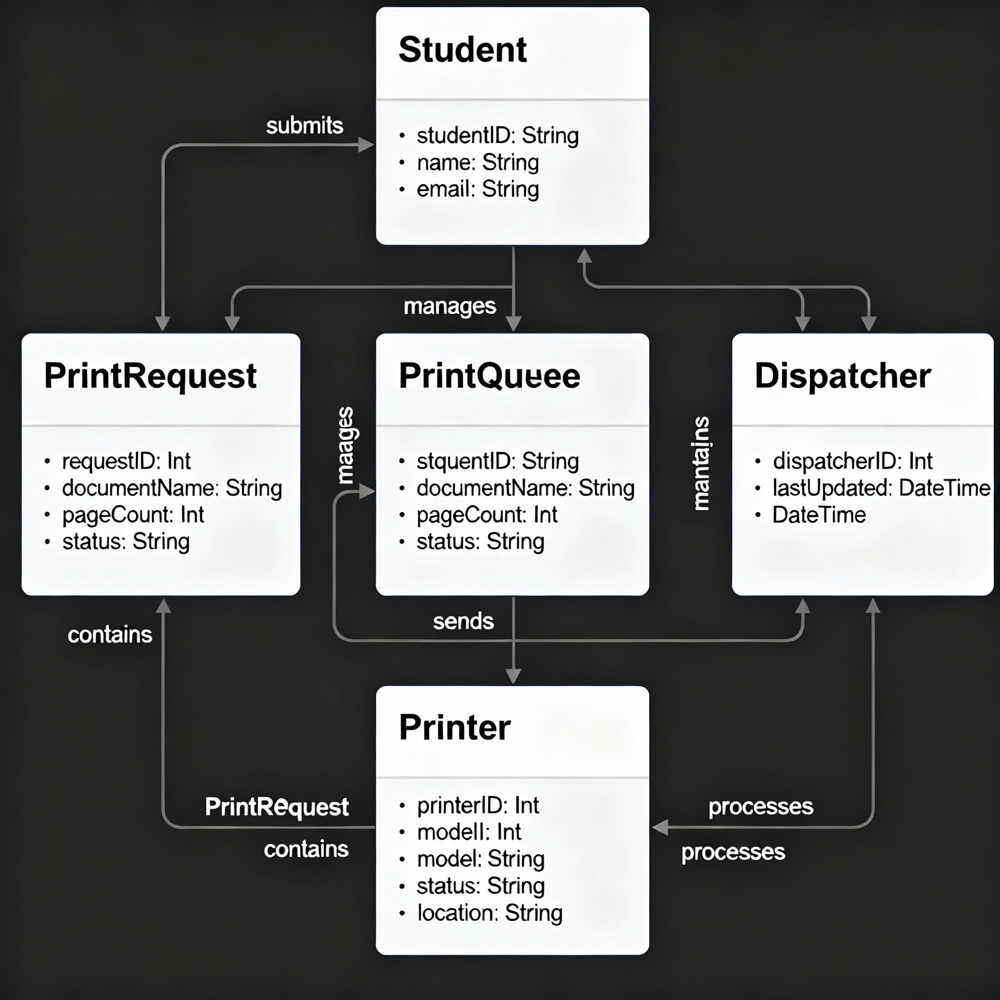
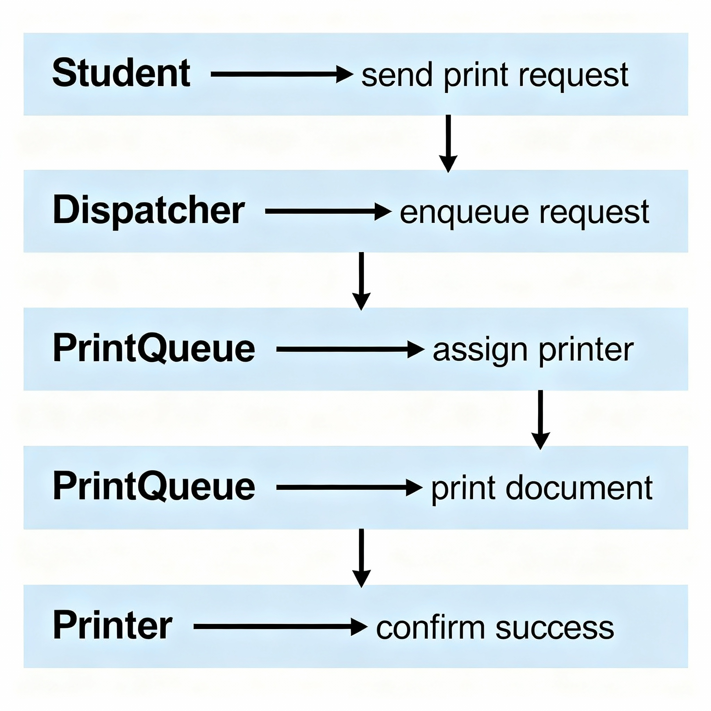
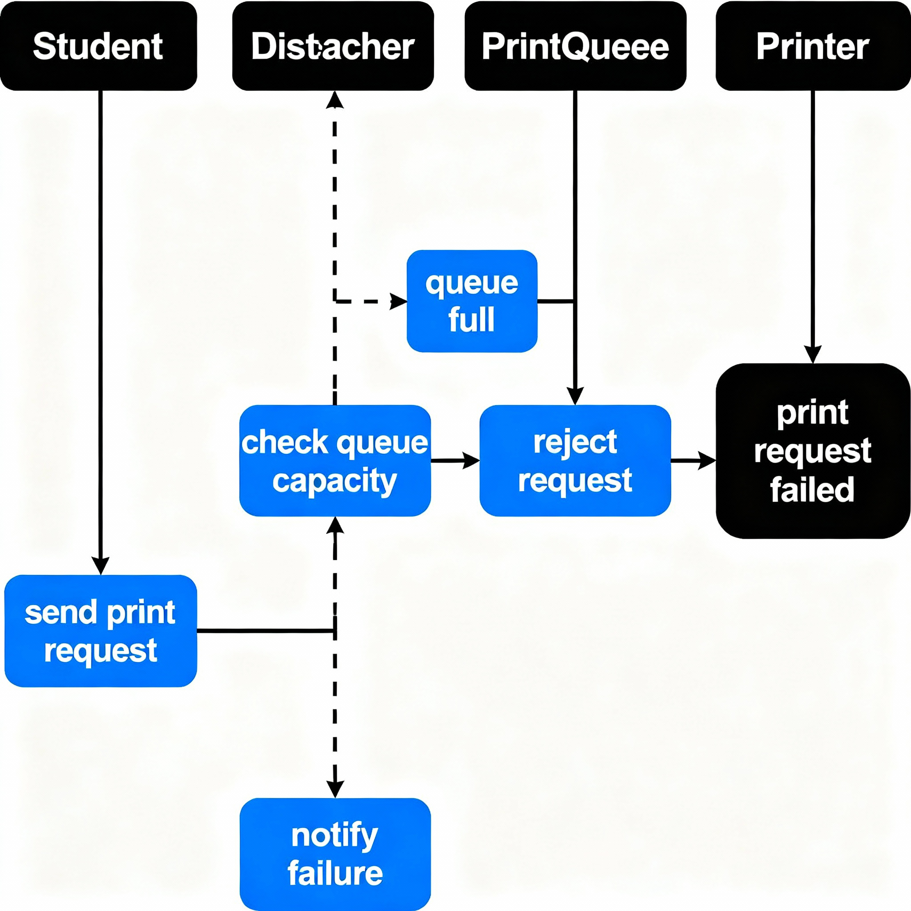

# APS — Архитектура программных систем

Лабораторная работа по курсу «Архитектура программных систем».  
**Бизнес-домен:** автоматизированный принт-центр университета.

## Описание предметной области

Система моделирует работу принт-центра для автоматизированной отправки, буферизации и распределения студенческих заявок на печать между несколькими принтерами с поддержкой обработки ошибок (отказ при переполнении очереди).

## Диаграмма классов (UML)

## Диаграммы последовательности (Sequence diagrams)

### Happy Flow (успешная печать)

- Студент отправляет заявку на печать.
- Диспетчер добавляет заявку в очередь.
- Если есть свободный принтер — заявка отправляется на печать.
- Принтер выполняет печать, возвращает подтверждение.

### Negative Flow (отказ)

- Студент отправляет заявку, но очередь принт-центра переполнена.
- Диспетчер отклоняет заявку и уведомляет студента об ошибке.

- `diagrams/` — все графические артефакты:
  - `class_diagram.png` — диаграмма классов
  - `happyflow.png` — sequence happy flow
  - `negativeflow.png` — sequence negative flow

